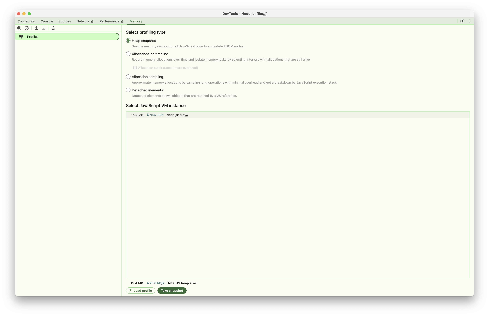

# NestJS Memory Leak Demo

This documentation describes the NestJS demo application for testing and demonstrating various types of memory leaks in Node.js/TypeScript environments.

## Overview

The NestJS demo provides interactive API endpoints to simulate different memory leak patterns commonly found in Node.js applications. This hands-on approach helps developers understand how memory leaks manifest and how to detect them using V8 heap dump analysis.

## Getting Started

### Prerequisites

- Node.js 22+
- pnpm
- Basic understanding of REST APIs

### Installation

```bash
cd nodejs/nestjs-demo
pnpm install
pnpm run start:dev
```

> 📖 **Quick Setup**: For rapid setup and API reference, see the project [README.md](https://github.com/lamngockhuong/memory-leak/blob/main/nodejs/nestjs-demo/README.md)
>
> 🎯 **This Guide**: Focuses on educational content and comprehensive heap dump analysis

## Base URL

```text
http://localhost:3000
```

## Available Memory Leak Patterns

The demo supports 5 different memory leak patterns:

### 1. Timer Leaks

- **Pattern**: Uncleaned setTimeout/setInterval objects
- **API**: `/memory-leak/timer/*`
- **Memory Impact**: Timer objects accumulate in memory

### 2. Cache Leaks

- **Pattern**: Unlimited cache growth without eviction
- **API**: `/memory-leak/cache/*`
- **Memory Impact**: ~8MB per cache entry

### 3. Closure Leaks

- **Pattern**: Functions holding large data in scope
- **API**: `/memory-leak/closure/*`
- **Memory Impact**: 10MB per closure function

### 4. Event Listener Leaks

- **Pattern**: EventEmitter listeners never removed
- **API**: `/memory-leak/event/*`
- **Memory Impact**: 8MB per listener

### 5. Global Variable Leaks

- **Pattern**: Global objects growing indefinitely
- **API**: `/memory-leak/global-variable/*`
- **Memory Impact**: ~8MB per global array

## Health Check

### GET `/health/ready`

Check if the application is ready to receive requests.

**Response:**

```json
{
  "status": "ok"
}
```

## 🔍 V8 Heap Dump Analysis

This section provides detailed guidance on analyzing memory leaks using V8 heap dumps and Chrome DevTools.

### Prerequisites for Analysis

- **Chrome Browser** (for DevTools)
- **Node.js** with `--inspect` flag enabled
- **Basic understanding** of JavaScript objects and references

### Setup for Heap Dump Analysis

#### 1. Start Application with Inspector

```bash
# Start the NestJS demo with inspector enabled
cd nodejs/nestjs-demo
node --inspect=0.0.0.0:9229 dist/main.js

# Or in development mode
pnpm run start:debug
```

#### 2. Connect Chrome DevTools

1. **Open Chrome browser**

2. **Navigate to `chrome://inspect`**

3. **Click "Open dedicated DevTools for Node"**

   
   *Opening dedicated DevTools for Node.js debugging*

4. **Go to "Memory" tab**

   
   *Chrome DevTools Memory tab interface for heap analysis*

#### 3. Take Baseline Heap Snapshot

Before triggering any memory leaks:

1. Click "Take heap snapshot"
2. Label it as "Baseline"
3. Note the heap size (typically 15-25MB for clean startup)

### Pattern-Specific Analysis

#### Timer Leaks Analysis

**Step 1: Trigger Timer Leak**

```bash
# Start timer leak
curl -X POST http://localhost:3000/memory-leak/timer/start

# Check status
curl http://localhost:3000/memory-leak/timer/status
```

**Step 2: Take Snapshot After 2 Minutes**

1. Wait 2 minutes for timers to accumulate
2. Take another heap snapshot
3. Label it "Timer Leak - 2min"

**Step 3: Analyze in Chrome DevTools**

**What to Look For:**

- **Timeout Objects**: Filter by "Timeout" in the snapshot
- **Memory Growth**: Compare heap sizes (baseline vs current)
- **Allocation Timeline**: Switch to "Allocation instrumentation on timeline"

**Key Indicators:**

```javascript
// Objects you'll see in heap dump:
- Timeout objects (increasing count)
- Timer callback functions
- Large ArrayBuffer objects (8MB each)
- Retained closures with timer data
```

**Analysis Steps:**

1. **Object Count Comparison**:
   - Baseline: ~0 Timeout objects
   - After leak: ~120 Timeout objects (1 per second × 120 seconds)

2. **Memory Allocation**:
   - Look for repeating allocation patterns
   - Each timer allocates ~8MB of data
   - Total growth: ~120 × 8MB = ~960MB

3. **Retention Path Analysis**:
   - Click on Timeout objects
   - Follow retention path to see what's keeping them alive
   - Should show timer callback → closure → large data

**Example Analysis Results:**

```
Heap Size Growth:
├── Baseline: 18MB
├── After 2min: 978MB
└── Growth: 960MB (120 timers × 8MB each)

Object Analysis:
├── Timeout objects: 120 instances
├── ArrayBuffer: 120 instances (8MB each)
└── Function closures: 120 instances
```

#### Cache Leaks Analysis

**Step 1: Trigger Cache Leak**

```bash
# Start cache leak
curl -X POST http://localhost:3000/memory-leak/cache/start

# Add entries to cache (repeat multiple times)
curl -X POST http://localhost:3000/memory-leak/cache/start
curl -X POST http://localhost:3000/memory-leak/cache/start

# Check cache stats
curl http://localhost:3000/memory-leak/cache/stats
```

**Step 2: Heap Dump Analysis**

**What to Look For:**

- **Map Objects**: Large Map instances in global scope
- **Cache Entries**: Each entry ~8MB
- **Memory Growth Pattern**: Linear with cache additions

**Key Indicators in DevTools:**

```javascript
// Objects visible in heap dump:
- Map objects with large size
- Cache entry objects
- String keys for cache entries
- Large Buffer/ArrayBuffer objects
```

**Analysis Process:**

1. **Find Cache Objects**:
   - Filter by "Map" or search for cache-related objects
   - Look for objects with many retained elements

2. **Measure Cache Impact**:
   - Each cache entry retains ~8MB
   - Count Map entries to estimate total memory
   - Check if cache has size limits

3. **Retention Analysis**:
   - Trace from global variables to cache
   - Verify cache cleanup mechanisms
   - Check for circular references

#### Closure Leaks Analysis

**Step 1: Trigger Closure Leak**

```bash
# Start closure leak
curl -X POST http://localhost:3000/memory-leak/closure/start

# Create multiple closures
curl -X POST http://localhost:3000/memory-leak/closure/start
curl -X POST http://localhost:3000/memory-leak/closure/start
```

**Step 2: Analyze Closure Retention**

**What to Look For:**

- **Function Objects**: Accumulated closure functions
- **Scope Objects**: Context retained by closures
- **Large Buffers**: Data captured in closure scope

**Analysis Techniques:**

1. **Function Object Analysis**:
   - Filter by "Function" in heap dump
   - Look for functions with large retained sizes
   - Each closure should retain ~10MB

2. **Scope Chain Analysis**:
   - Examine function scope properties
   - Look for captured variables
   - Identify unnecessary data retention

**Example Findings:**

```
Closure Analysis Results:
├── Function objects: 3 instances
├── Retained per closure: ~10MB
├── Total memory impact: ~30MB
└── Scope chain: Contains large buffers
```

#### Event Listener Leaks Analysis

**Step 1: Trigger Event Leak**

```bash
# Start event listener leak
curl -X POST http://localhost:3000/memory-leak/event/start

# Trigger events to see accumulation
curl -X POST http://localhost:3000/memory-leak/event/trigger
```

**Step 2: Analyze EventEmitter Objects**

**What to Look For:**

- **EventEmitter Objects**: Check _events property
- **Listener Functions**: Accumulated event handlers
- **Event Data**: Large objects retained by listeners

**Analysis Steps:**

1. **EventEmitter Inspection**:
   - Find EventEmitter instances
   - Check _events property size
   - Count listener functions

2. **Listener Retention**:
   - Each listener retains ~8MB of data
   - Verify listener cleanup on component destruction
   - Check for listener accumulation patterns

#### Global Variable Leaks Analysis

**Step 1: Trigger Global Leak**

```bash
# Start global variable leak
curl -X POST http://localhost:3000/memory-leak/global-variable/start
```

**Step 2: Analyze Global Object Growth**

**What to Look For:**

- **Global Object Properties**: New properties on global scope
- **Array Growth**: Arrays attached to global that grow over time
- **Object References**: Objects referenced by global variables

**Analysis Process:**

1. **Global Scope Inspection**:
   - Look for global object in heap dump
   - Check for custom properties
   - Measure array sizes

2. **Reference Tracking**:
   - Follow references from global to data
   - Calculate memory impact per global variable
   - Check cleanup mechanisms

### Comparative Analysis Techniques

#### Before/After Comparison

1. **Take Multiple Snapshots**:
   - Baseline (clean state)
   - During leak (active memory consumption)
   - After cleanup (post-cleanup state)

2. **Use Comparison View**:
   - Select two snapshots in DevTools
   - Use "Comparison" view to see differences
   - Focus on object count changes

#### Memory Allocation Timeline

1. **Enable Allocation Timeline**:
   - Switch to "Allocation instrumentation on timeline"
   - Start recording before triggering leaks
   - Stop recording after leak accumulation

2. **Analyze Allocation Patterns**:
   - Look for repetitive allocation spikes
   - Identify memory allocation sources
   - Find objects that aren't being freed

### Advanced Analysis Tips

#### 1. Object Grouping

```javascript
// Group objects by constructor in DevTools:
- Filter by constructor name (e.g., "Timeout", "Map", "Function")
- Sort by retained size to find largest consumers
- Use shallow vs retained size to understand references
```

#### 2. Retention Path Analysis

```javascript
// For any large object:
1. Right-click → "Reveal in Summary view"
2. Check "Retainers" section
3. Follow the path from GC roots
4. Identify unexpected retention sources
```

#### 3. Memory Usage Patterns

```javascript
// Common patterns to identify:
- Linear growth: Indicates accumulation without cleanup
- Stepped growth: Batch allocations
- Periodic spikes: Regular allocation/deallocation cycles
- Flat line after cleanup: Successful memory recovery
```

### Automated Analysis Scripts

#### Memory Monitoring Script

```javascript
// Add to your test suite:
function monitorMemoryGrowth(durationMs = 60000) {
  const initial = process.memoryUsage();

  return new Promise((resolve) => {
    const interval = setInterval(() => {
      const current = process.memoryUsage();
      const growth = {
        rss: current.rss - initial.rss,
        heapUsed: current.heapUsed - initial.heapUsed,
        heapTotal: current.heapTotal - initial.heapTotal
      };

      console.log('Memory Growth:', {
        rss: `${Math.round(growth.rss / 1024 / 1024)}MB`,
        heapUsed: `${Math.round(growth.heapUsed / 1024 / 1024)}MB`
      });
    }, 5000);

    setTimeout(() => {
      clearInterval(interval);
      resolve(process.memoryUsage());
    }, durationMs);
  });
}

// Usage:
await monitorMemoryGrowth(120000); // Monitor for 2 minutes
```

### Best Practices for Heap Analysis

#### 1. Baseline Establishment

- Always take a baseline snapshot before testing
- Restart the application between different leak tests
- Use consistent testing conditions (same load, same time intervals)

#### 2. Progressive Analysis

- Start with small leak durations (30 seconds)
- Gradually increase duration to see growth patterns
- Stop leaks before system resources are exhausted

#### 3. Cleanup Verification

- Take snapshots after stopping leaks
- Verify memory returns to baseline levels
- Check for persistent objects that should have been cleaned

#### 4. Documentation

- Label snapshots clearly with timestamps and actions
- Document the steps taken to reproduce each leak
- Save heap dump files for later comparison

### Troubleshooting Common Issues

#### DevTools Connection Issues

```bash
# If Chrome can't connect to Node inspector:
1. Check firewall settings
2. Verify port 9229 is open
3. Try different inspector ports: --inspect=9230
4. Use --inspect-brk to pause on startup
```

#### Large Heap Dump Files

```bash
# For heap dumps larger than 1GB:
1. Use Chrome Canary (supports larger dumps)
2. Increase Node.js memory limit: --max-old-space-size=8192
3. Take snapshots more frequently to catch growth early
4. Focus on specific object types rather than full dumps
```

#### Memory Not Released

```bash
# If memory doesn't return to baseline:
1. Force garbage collection: global.gc() (with --expose-gc)
2. Check for global variable pollution
3. Verify all event listeners are removed
4. Look for circular references in heap dump
```

## API Endpoints Reference

### Pattern-Specific Endpoints

Each memory leak pattern follows a consistent API structure:

```bash
POST /memory-leak/{pattern}/start  # Start the leak
POST /memory-leak/{pattern}/stop   # Stop and cleanup
GET  /memory-leak/{pattern}/status # Get current stats
```

Where `{pattern}` can be: `timer`, `cache`, `closure`, `event`, `global-variable`

### Timer Memory Leaks

#### POST `/memory-leak/timer/start`

Starts a new timer-based memory leak.

**Response:**

```json
{
  "message": "Timer leak started",
  "stats": {
    "activeTimers": 1,
    "memoryAllocated": 0,
    "isLeaking": true
  }
}
```

#### GET `/memory-leak/timer/status`

Check the current status of timer leaks.

**Response:**

```json
{
  "message": "Timer leak status",
  "stats": {
    "activeTimers": 2,
    "memoryAllocated": 160,
    "isLeaking": true
  }
}
```

#### POST `/memory-leak/timer/stop`

Stop all active timer leaks.

**Response:**

```json
{
  "message": "Timer leak stopped",
  "stats": {
    "activeTimers": 0,
    "memoryAllocated": 0,
    "isLeaking": false
  }
}
```

### Cache Memory Leaks

#### POST `/memory-leak/cache/start`

Starts cache memory leak by adding large objects to cache.

**Response:**

```json
{
  "message": "Cache leak started",
  "stats": {
    "size": 1,
    "memoryUsage": "8MB",
    "maxSize": 1000
  }
}
```

#### GET `/memory-leak/cache/stats`

Get detailed cache statistics.

**Response:**

```json
{
  "size": 15,
  "memoryUsage": "120MB",
  "maxSize": 1000,
  "isLeaking": true
}
```

### Closure Memory Leaks

#### POST `/memory-leak/closure/start`

Creates closures that capture large data in scope.

**Response:**

```json
{
  "message": "Closure leak started",
  "stats": {
    "activeFunctions": 1,
    "memoryAllocated": 10,
    "isLeaking": true
  }
}
```

### Event Listener Leaks

#### POST `/memory-leak/event/start`

Adds event listeners with large closure data.

**Response:**

```json
{
  "message": "Event leak started",
  "stats": {
    "activeListeners": 1,
    "totalMemoryAllocated": 8,
    "isLeaking": true
  }
}
```

#### POST `/memory-leak/event/trigger`

Triggers all registered event listeners.

**Response:**

```json
{
  "message": "Event triggered",
  "listenersNotified": 5
}
```

### Global Variable Leaks

#### POST `/memory-leak/global-variable/start`

Creates global variables that accumulate data.

**Response:**

```json
{
  "message": "Global variable leak started",
  "stats": {
    "globalArrays": 1,
    "totalMemoryUsage": 8,
    "isLeaking": true
  }
}
```

### Overall Status

#### GET `/memory-leak/status`

Get overview of all memory leak patterns.

**Response:**

```json
{
  "timestamp": "2025-09-06T10:30:00.000Z",
  "patterns": {
    "timer": {
      "message": "Timer leak status",
      "stats": {
        "activeTimers": 2,
        "memoryAllocated": 160,
        "isLeaking": true
      }
    },
    "cache": {
      "isLeaking": true,
      "stats": {
        "size": 15,
        "memoryUsage": "120MB",
        "maxSize": 1000
      },
      "message": "Cache status"
    },
    "closure": {
      "activeFunctions": 3,
      "memoryAllocated": 30,
      "isLeaking": true
    },
    "event": {
      "activeListeners": 4,
      "totalMemoryAllocated": 32,
      "isLeaking": true
    },
    "globalVariable": {
      "globalArrays": 2,
      "totalMemoryUsage": 16,
      "isLeaking": true
    }
  },
  "memory": {
    "rss": 245678080,
    "heapUsed": 156432384,
    "heapTotal": 178946048,
    "external": 2841600
  }
}
```

## Debug Endpoints

### POST `/internal/debug/heapdump`

Generate a heap dump for memory analysis.

**Headers:**

```text
x-admin-token: heapdump_demo
```

**Response:**

```text
dump started
```

**Notes:**

- Requires admin token for security (configured via `HEAPDUMP_TOKEN` environment variable)
- Heap dumps are saved to `./heapdumps/` directory
- Returns 202 status and processes dump in background
- Use Chrome DevTools or other heap analysis tools to examine

## Usage Examples

### Testing Timer Leaks with Heap Analysis

```bash
# 1. Take baseline heap snapshot in Chrome DevTools

# 2. Start timer leak
curl -X POST http://localhost:3000/memory-leak/timer/start

# 3. Check status periodically
curl http://localhost:3000/memory-leak/timer/status

# 4. Wait 2 minutes, then take another heap snapshot

# 5. Stop the leak
curl -X POST http://localhost:3000/memory-leak/timer/stop

# 6. Take final heap snapshot to verify cleanup
```

**Expected Behavior:**

- **Memory Growth**: ~8MB per second per active timer
- **Heap Objects**: Increasing Timeout object count
- **Cleanup**: Memory should stabilize after stopping

### Testing Multiple Patterns Simultaneously

```bash
# Start multiple different leaks
curl -X POST http://localhost:3000/memory-leak/timer/start
curl -X POST http://localhost:3000/memory-leak/cache/start
curl -X POST http://localhost:3000/memory-leak/event/start

# Check overall status
curl http://localhost:3000/memory-leak/status

# Monitor for 3 minutes with heap snapshots

# Stop all leaks
curl -X POST http://localhost:3000/memory-leak/timer/stop
curl -X POST http://localhost:3000/memory-leak/cache/stop
curl -X POST http://localhost:3000/memory-leak/event/stop
```

### Cache Leak Analysis Workflow

```bash
# 1. Baseline snapshot

# 2. Start cache leak and add entries
curl -X POST http://localhost:3000/memory-leak/cache/start
curl -X POST http://localhost:3000/memory-leak/cache/start
curl -X POST http://localhost:3000/memory-leak/cache/start

# 3. Check cache stats
curl http://localhost:3000/memory-leak/cache/stats

# 4. Take heap snapshot - look for Map objects

# 5. Add more entries
for i in {1..10}; do
  curl -X POST http://localhost:3000/memory-leak/cache/start
done

# 6. Final snapshot and comparison
curl http://localhost:3000/memory-leak/cache/stats
```

### Generating Heap Dumps for Analysis

```bash
# Method 1: API endpoint (requires token)
curl -X POST \
  -H "x-admin-token: heapdump_demo" \
  http://localhost:3000/internal/debug/heapdump

# Method 2: Signal-based (macOS/Linux)
# Find Node.js process ID
ps aux | grep node | grep nestjs-demo

# Send USR2 signal to generate heap dump
kill -USR2 <process_id>

# Method 3: Programmatic via Chrome DevTools
# Use Chrome DevTools Memory tab -> Take heap snapshot
```

## Memory Monitoring and Analysis

### Real-time Memory Monitoring

#### Command Line Monitoring

```bash
# Monitor Node.js process memory usage
watch -n 1 'ps aux | grep node | grep nestjs | grep -v grep'

# Monitor system memory
watch -n 1 'free -h'

# Use htop for interactive monitoring
htop -p $(pgrep -f nestjs-demo)
```

#### Application-Level Monitoring

```javascript
// Add this to monitor memory in your application
setInterval(() => {
  const usage = process.memoryUsage();
  console.log('Memory Usage:', {
    rss: `${Math.round(usage.rss / 1024 / 1024)} MB`,
    heapUsed: `${Math.round(usage.heapUsed / 1024 / 1024)} MB`,
    heapTotal: `${Math.round(usage.heapTotal / 1024 / 1024)} MB`,
    external: `${Math.round(usage.external / 1024 / 1024)} MB`
  });
}, 5000);
```

### Expected Memory Patterns

#### Timer Leaks

- **Growth Rate**: ~8MB per second per active timer
- **Pattern**: Linear increase while timer is running
- **Cleanup**: Immediate memory stabilization when stopped
- **Heap Objects**: Timeout objects accumulate, released on cleanup

#### Cache Leaks

- **Growth Rate**: ~8MB per cache entry
- **Pattern**: Stepped increases with each cache addition
- **Cleanup**: Memory released when cache is cleared
- **Heap Objects**: Map objects with large retained sizes

#### Closure Leaks

- **Growth Rate**: ~10MB per closure function
- **Pattern**: Incremental growth with each closure creation
- **Cleanup**: Functions and scope data released when cleared
- **Heap Objects**: Function objects with large retained contexts

#### Event Listener Leaks

- **Growth Rate**: ~8MB per event listener
- **Pattern**: Stepped growth with listener registration
- **Cleanup**: Listeners and associated data released on cleanup
- **Heap Objects**: EventEmitter with accumulated _events

#### Global Variable Leaks

- **Growth Rate**: ~8MB per global array/object
- **Pattern**: Permanent growth until explicit cleanup
- **Cleanup**: Requires explicit global property deletion
- **Heap Objects**: Large arrays/objects attached to global scope

### Integration with Testing

#### Automated Memory Testing

```javascript
// Example Jest test for memory leak detection
describe('Memory Leak Detection', () => {
  it('should not leak memory with timer operations', async () => {
    const initialMemory = process.memoryUsage().heapUsed;

    // Start timer leak
    await request(app)
      .post('/memory-leak/timer/start')
      .expect(201);

    // Wait for memory accumulation
    await new Promise(resolve => setTimeout(resolve, 5000));

    const duringLeakMemory = process.memoryUsage().heapUsed;
    expect(duringLeakMemory).toBeGreaterThan(initialMemory + 5 * 1024 * 1024); // 5MB growth

    // Stop leak
    await request(app)
      .post('/memory-leak/timer/stop')
      .expect(201);

    // Allow cleanup
    await new Promise(resolve => setTimeout(resolve, 2000));
    global.gc && global.gc(); // Force GC if available

    const finalMemory = process.memoryUsage().heapUsed;
    expect(finalMemory).toBeLessThan(duringLeakMemory); // Memory should decrease
  });
});
```

## Security and Safety Notes

### Production Considerations

- **Never deploy** this demo application to production environments
- **Remove debug endpoints** in production builds
- **Secure admin tokens** - change default `HEAPDUMP_TOKEN` value
- **Monitor resource usage** to prevent system exhaustion

### Safe Testing Practices

- **Test in isolation** - use dedicated development/testing environments
- **Set time limits** - don't run leaks indefinitely
- **Monitor system resources** - stop tests if memory usage becomes critical
- **Clean up after tests** - always stop active leaks when finished

### Resource Limits

```bash
# Set Node.js memory limits for testing
node --max-old-space-size=4096 dist/main.js  # 4GB limit

# Monitor memory usage during tests
while true; do
  memory=$(ps -o pid,vsz,rss,comm -p $(pgrep -f nestjs-demo) | tail -1 | awk '{print $3}')
  if [ "$memory" -gt 2000000 ]; then  # 2GB in KB
    echo "Memory usage critical: ${memory}KB"
    break
  fi
  sleep 5
done
```

## Troubleshooting

### Common Issues

#### Port Already in Use

```bash
# Find and kill processes using port 3000
lsof -ti:3000 | xargs kill -9

# Or use a different port
PORT=3001 npm run start:dev
```

#### Application Becomes Unresponsive

```bash
# Force stop all leaks via API
curl -X POST http://localhost:3000/memory-leak/timer/stop
curl -X POST http://localhost:3000/memory-leak/cache/stop
curl -X POST http://localhost:3000/memory-leak/closure/stop
curl -X POST http://localhost:3000/memory-leak/event/stop
curl -X POST http://localhost:3000/memory-leak/global-variable/stop

# If API is unresponsive, restart the process
pkill -f nestjs-demo
```

#### Heap Dump Generation Fails

```bash
# Ensure sufficient disk space for heap dumps
df -h ./heapdumps/

# Check write permissions
ls -la ./heapdumps/

# Verify admin token
export HEAPDUMP_TOKEN=heapdump_demo
```

#### Chrome DevTools Connection Issues

```bash
# Start with specific inspector configuration
node --inspect=0.0.0.0:9229 --inspect-brk dist/main.js

# Try different ports if 9229 is occupied
node --inspect=0.0.0.0:9230 dist/main.js

# Check firewall settings for inspector port
```

### Memory Analysis Troubleshooting

#### Large Heap Dumps

- Use Chrome Canary for large heap dump support
- Increase Node.js memory limits: `--max-old-space-size=8192`
- Take snapshots more frequently to catch growth early
- Focus analysis on specific object types

#### Unexpected Memory Retention

- Check for global variable pollution
- Verify all event listeners are properly removed
- Look for circular references in heap dumps
- Force garbage collection with `global.gc()` (requires `--expose-gc`)

#### Analysis Performance Issues

- Filter heap dumps by object type
- Use comparison view instead of full analysis
- Focus on objects with large retained sizes
- Take smaller, targeted snapshots

## Additional Resources

### V8 Heap Dump Analysis Tools

- **Chrome DevTools**: Built-in memory profiling
- **heapdump npm package**: Programmatic heap dump generation
- **clinic.js**: Comprehensive Node.js performance analysis
- **0x**: Flame graph generation for CPU profiling

### Learning Resources

- [V8 Memory Management](https://v8.dev/blog/trash-talk)
- [Chrome DevTools Memory Features](https://developer.chrome.com/docs/devtools/memory/)
- [Node.js Memory Management](https://nodejs.org/en/docs/guides/simple-profiling/)
- [JavaScript Memory Management MDN](https://developer.mozilla.org/en-US/docs/Web/JavaScript/Memory_Management)
