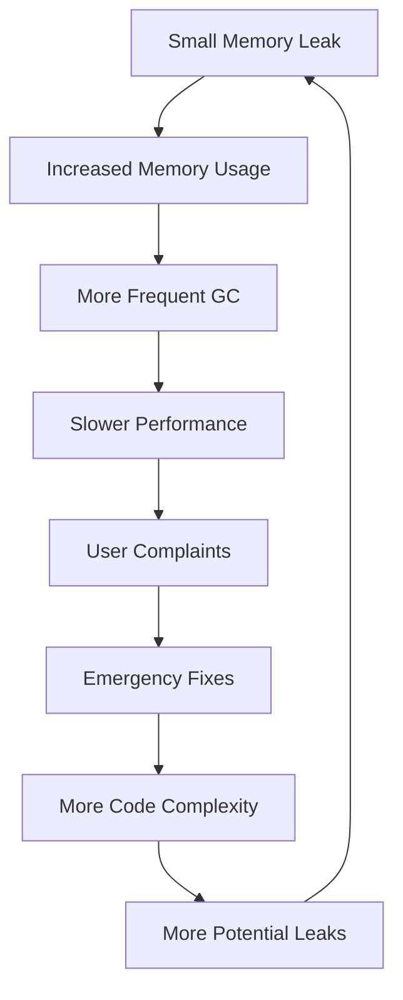

# Why Memory Leak Matters

Memory leaks are one of the most insidious and costly problems in software development. While they might seem like minor technical details, their impact can be devastating to applications, businesses, and user experiences. Understanding why memory leaks matter is crucial for every developer, regardless of experience level.

## The Real-World Impact

### 🚨 System Performance Degradation

Memory leaks don't just consume RAM—they gradually strangle your application's performance:

- **Slower Response Times**: As available memory decreases, applications spend more time on garbage collection and memory management
- **Increased CPU Usage**: The system works harder to manage fragmented memory spaces
- **Reduced Throughput**: Applications can handle fewer concurrent operations as memory becomes scarce

### 💰 Financial Consequences

The cost of memory leaks extends far beyond development time:

#### Cloud Infrastructure Costs

- Increased server instances to compensate for memory bloat
- Higher auto-scaling triggers leading to unnecessary resource allocation
- Wasted compute resources that could be used for actual business logic

#### Business Impact

- Lost revenue from application downtime
- Customer churn due to poor user experience
- Increased support costs from performance-related issues

### 📱 User Experience Deterioration

Memory leaks directly impact end users:

- **Mobile Applications**: Battery drain, device heating, and app crashes
- **Web Applications**: Browser tab crashes, slow page loads, and unresponsive interfaces
- **Desktop Applications**: System freezes, application crashes, and data loss

## Common Scenarios Where Memory Leaks Cause Havoc

### E-commerce Platforms

```text
During Black Friday sales:
- Shopping cart functionality becomes sluggish
- Checkout process fails intermittently
- Server crashes during peak traffic
- Result: Millions in lost revenue
```

### Gaming Applications

```text
During extended gameplay sessions:
- Frame rates drop progressively
- Game world loading becomes slower
- Eventually crashes, losing player progress
- Result: Poor reviews and player attrition
```

### Enterprise Applications

```text
In 24/7 business operations:
- CRM systems become unresponsive
- Data processing jobs fail
- Automated workflows halt
- Result: Business disruption and productivity loss
```

## The Hidden Nature of Memory Leaks

### Why They're Hard to Detect

1. **Gradual Degradation**: Memory leaks often develop slowly, making them hard to notice during development
2. **Environment Differences**: They may only manifest under production load conditions
3. **Complex Interactions**: Modern applications have intricate dependency chains where leaks can hide
4. **Intermittent Symptoms**: Performance issues may seem random or attributed to other causes

### The Snowball Effect

Memory leaks have a compounding nature:



## Industry Statistics

*Note: The following statistics represent general industry trends and observations from the software development community.*

### Development Impact

- **Majority** of production issues in long-running applications are memory-related
- Memory leaks are a **leading cause** of unplanned application restarts
- **Significant portion** of customer-reported performance issues trace back to memory management problems

### Financial Impact

- Downtime costs for e-commerce sites can range from **thousands to tens of thousands per minute**
- Memory inefficiencies can **substantially increase** infrastructure costs
- Poor application performance **significantly reduces** user engagement and retention

## Modern Development Challenges

### Microservices Architecture

- Multiple services with independent memory management
- Cascading failures when one service has memory issues
- Complex monitoring across distributed systems

### Container Orchestration

- Memory limits can cause unexpected pod terminations
- Resource allocation becomes critical for stability
- Horizontal scaling masks but doesn't solve memory leaks

### Real-time Applications

- WebSocket connections that accumulate memory
- Event listeners that aren't properly cleaned up
- Streaming data that builds up in memory buffers

## The Cost of Ignorance

### Technical Debt

Ignoring memory leaks leads to:

- **Reactive Development**: Constantly fixing performance issues instead of building features
- **Architecture Constraints**: Having to design around memory limitations
- **Testing Complexity**: Needing extensive performance testing for simple changes

### Team Morale

- **Frustration**: Developers spending time on mysterious performance issues
- **Reputation**: Teams becoming known for "slow" or "unreliable" applications
- **Career Impact**: Poor application performance reflecting on development skills

## The Prevention Advantage

### Proactive Benefits

When teams prioritize memory leak prevention:

- **Predictable Performance**: Applications behave consistently under load
- **Lower Costs**: Efficient resource utilization reduces infrastructure needs
- **Better User Experience**: Stable, fast applications increase user satisfaction
- **Easier Maintenance**: Clean memory management simplifies debugging and enhancement

### Competitive Edge

Applications without memory leaks:

- Handle higher loads with the same hardware
- Provide better user experiences
- Require less operational overhead
- Scale more predictably

## Conclusion

Memory leaks matter because they represent a fundamental threat to application reliability, user satisfaction, and business success. In today's competitive software landscape, applications that suffer from memory management issues quickly fall behind those that maintain clean, efficient memory usage.

The investment in understanding and preventing memory leaks pays dividends in:

- **Reduced operational costs**
- **Improved user retention**
- **Higher development velocity**
- **Better system reliability**
- **Enhanced team reputation**

As we move forward in this guide, remember that every technique, pattern, and best practice we discuss serves a single ultimate goal: **building applications that users can depend on, businesses can rely on, and developers can be proud of**.

::: tip Remember
Memory leaks are not just technical problems - they're business problems that affect real people and real outcomes. The time invested in learning proper memory management is time invested in professional excellence.
:::
