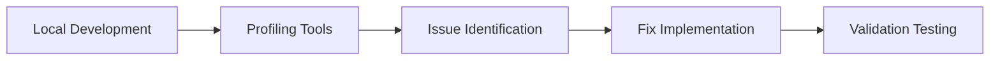
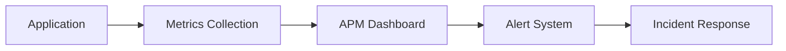

# Memory Leak Detection Tools

This section provides comprehensive guides for various tools and utilities used to detect, analyze, and prevent memory leaks across different programming languages and environments.

## Available Tools

### Browser-Based Tools

#### [Browser Developer Tools](./browser-devtools.md)

Learn how to use built-in browser developer tools for client-side memory leak detection:

- **Chrome DevTools**: Memory tab, Performance profiling, Heap snapshots
- **Firefox Developer Tools**: Memory analysis, Allocation timeline
- **Safari Web Inspector**: Memory debugging and performance analysis
- **Edge DevTools**: Memory investigation and optimization

*Best for: Frontend JavaScript applications, web performance optimization*

---

### Server-Side Profiling

#### [Node.js Profiling Tools](./nodejs-profiling.md)

Comprehensive guide to Node.js memory profiling and monitoring:

- **Built-in Tools**: Node Inspector, V8 profiling options
- **Third-party Libraries**: Clinic.js, 0x, heapdump, memwatch-next
- **Production Monitoring**: APM integration, custom metrics
- **Container Support**: Docker and Kubernetes memory management

*Best for: Node.js applications, server-side JavaScript, microservices*

#### [Java Memory Tools](./java-tools.md)

Enterprise-grade Java memory leak detection and analysis:

- **JVM Profilers**: JProfiler, VisualVM, Eclipse MAT
- **Built-in Tools**: JConsole, Java Flight Recorder, jmap
- **APM Solutions**: New Relic, AppDynamics, DataDog
- **Production Deployment**: JVM tuning, monitoring strategies

*Best for: Enterprise Java applications, Spring Boot, microservices*

#### [Go Profiling Tools](./go-tools.md)

Modern Go application memory profiling and optimization:

- **Built-in Tools**: pprof, trace, runtime profiling
- **Third-party Services**: Pyroscope, Grafana Phlare, Google Cloud Profiler
- **Development Integration**: IDE support, debugging workflows
- **Production Monitoring**: Continuous profiling, metrics collection

*Best for: Go applications, cloud-native services, high-performance systems*

---

### CI/CD Integration

#### [CI/CD Integration](./cicd-integration.md)

Automated memory leak detection in development pipelines:

- **Platform Integration**: GitHub Actions, GitLab CI, Jenkins, Azure DevOps
- **Automated Testing**: Memory leak detection in CI/CD
- **Performance Regression**: Automated memory usage comparison
- **Quality Gates**: Memory thresholds and governance

*Best for: DevOps teams, continuous integration, quality assurance*

---

## Tool Selection Guide

### By Development Phase

| Phase | Recommended Tools | Primary Use Cases |
|-------|------------------|-------------------|
| **Development** | Browser DevTools, IDE profilers | Local debugging, immediate feedback |
| **Testing** | Language-specific profilers, CI/CD tools | Automated testing, regression detection |
| **Staging** | APM tools, performance profilers | Pre-production validation |
| **Production** | APM solutions, continuous profilers | Live monitoring, alerting |

### By Application Type

| Application Type | Primary Tools | Secondary Tools |
|-----------------|---------------|-----------------|
| **Web Frontend** | Browser DevTools | Performance monitoring |
| **Node.js Backend** | Node.js profilers, APM | Container monitoring |
| **Java Enterprise** | JVM profilers, APM | Application servers |
| **Go Services** | pprof, continuous profiling | Cloud monitoring |
| **Microservices** | APM, container tools | Service mesh monitoring |

### By Team Size

| Team Size | Recommended Approach | Tools Focus |
|-----------|---------------------|-------------|
| **Individual/Small** | Built-in tools, open source | Free profilers, browser tools |
| **Medium** | Mix of free and commercial | APM trials, team profilers |
| **Enterprise** | Commercial APM, enterprise tools | Full monitoring suites |

## Getting Started

### Quick Start Checklist

1. **Identify Your Stack**: Determine primary programming languages and frameworks
2. **Choose Development Tools**: Select appropriate profiling tools for local development
3. **Set Up Monitoring**: Implement basic memory monitoring in your applications
4. **Configure Alerts**: Set up threshold-based alerting for memory usage
5. **Establish Baselines**: Create memory usage baselines for normal operations
6. **Plan for Scale**: Consider production monitoring and APM solutions

### Common Integration Patterns

#### Development Workflow

#### Production Monitoring

## Best Practices

### Tool Integration

- **Layer Your Approach**: Use different tools for different phases
- **Automate Where Possible**: Integrate profiling into CI/CD pipelines
- **Monitor Continuously**: Implement ongoing production monitoring
- **Establish Baselines**: Create performance and memory baselines
- **Plan for Incidents**: Have memory leak incident response procedures

### Cost Optimization

- **Start Simple**: Begin with built-in and free tools
- **Prove Value**: Demonstrate ROI before investing in commercial tools
- **Right-size Solutions**: Match tool complexity to team needs
- **Consider Long-term**: Plan for scaling and team growth

## Contributing

Each tool guide is open for contributions. We welcome:

- **Real-world Examples**: Practical use cases and implementations
- **Best Practices**: Industry-proven approaches and patterns
- **Tool Updates**: New features and capability updates
- **Integration Guides**: Step-by-step setup and configuration

See our [Contributing Guidelines](https://github.com/lamngockhuong/memory-leak/blob/main/CONTRIBUTING.md) for more information on how to contribute.

---

*Need help choosing the right tools? Check out our [Getting Started Guide](../getting-started.md) or explore the individual tool documentation above.*
