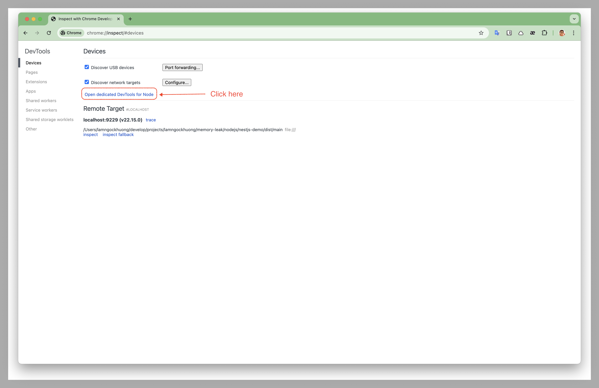
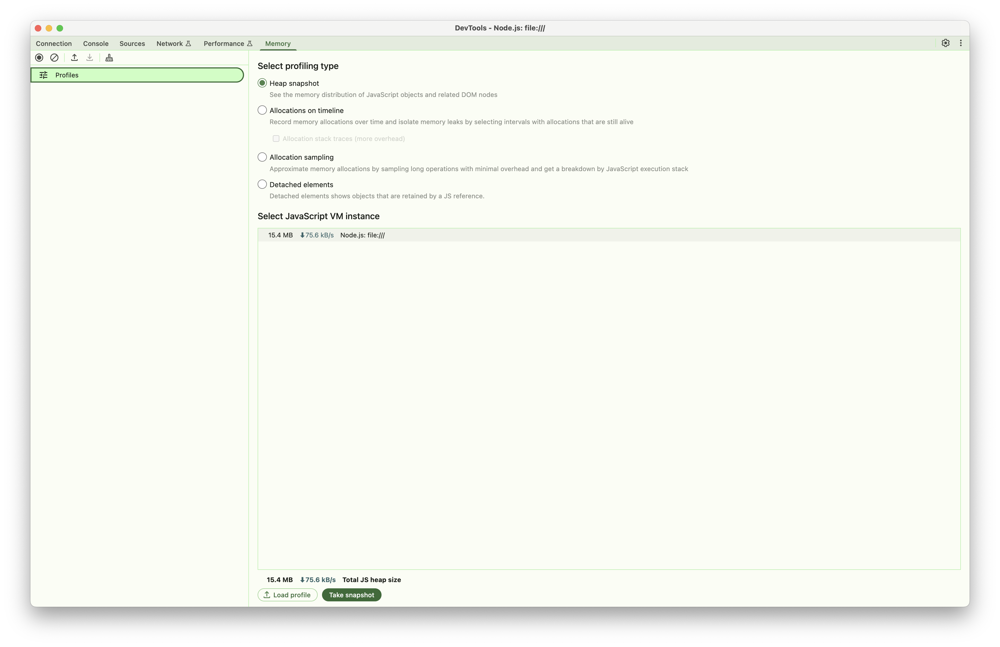

# Demo Memory Leak NestJS

Tài liệu này mô tả ứng dụng demo NestJS để kiểm tra và minh họa các loại memory leak khác nhau trong môi trường Node.js/TypeScript.

## Tổng quan

Demo NestJS cung cấp các API endpoint tương tác để mô phỏng các pattern memory leak phổ biến trong ứng dụng Node.js. Phương pháp thực hành này giúp các nhà phát triển hiểu cách memory leak biểu hiện và cách phát hiện chúng bằng phân tích V8 heap dump.

## Bắt đầu

### Yêu cầu hệ thống

- Node.js 22+
- pnpm
- Hiểu biết cơ bản về REST APIs

### Cài đặt

```bash
cd nodejs/nestjs-demo
pnpm install
pnpm run start:dev
```

> 📖 **Thiết lập nhanh**: Để thiết lập nhanh và tham khảo API, xem [README.md](https://github.com/lamngockhuong/memory-leak/blob/main/nodejs/nestjs-demo/README.md) của dự án
>
> 🎯 **Hướng dẫn này**: Tập trung vào nội dung giáo dục và phân tích heap dump toàn diện

## Base URL

```text
http://localhost:3000
```

## Các Pattern Memory Leak có sẵn

Demo hỗ trợ 5 pattern memory leak khác nhau:

### 1. Timer Leaks

- **Pattern**: Các đối tượng setTimeout/setInterval không được dọn dẹp
- **API**: `/memory-leak/timer/*`
- **Tác động bộ nhớ**: Các đối tượng timer tích lũy trong bộ nhớ

### 2. Cache Leaks

- **Pattern**: Cache tăng trưởng không giới hạn mà không có cơ chế eviction
- **API**: `/memory-leak/cache/*`
- **Tác động bộ nhớ**: ~8MB mỗi cache entry

### 3. Closure Leaks

- **Pattern**: Các function giữ dữ liệu lớn trong scope
- **API**: `/memory-leak/closure/*`
- **Tác động bộ nhớ**: 10MB mỗi closure function

### 4. Event Listener Leaks

- **Pattern**: EventEmitter listener không bao giờ được remove
- **API**: `/memory-leak/event/*`
- **Tác động bộ nhớ**: 8MB mỗi listener

### 5. Global Variable Leaks

- **Pattern**: Các đối tượng global tăng trưởng vô hạn
- **API**: `/memory-leak/global-variable/*`
- **Tác động bộ nhớ**: ~8MB mỗi global array

## Health Check

### GET `/health/ready`

Kiểm tra xem ứng dụng đã sẵn sàng nhận request chưa.

**Response:**

```json
{
  "status": "ok"
}
```

## 🔍 Phân tích V8 Heap Dump

Phần này cung cấp hướng dẫn chi tiết về việc phân tích memory leak bằng V8 heap dumps và Chrome DevTools.

### Yêu cầu cho việc phân tích

- **Trình duyệt Chrome** (cho DevTools)
- **Node.js** với flag `--inspect` được bật
- **Hiểu biết cơ bản** về JavaScript objects và references

### Thiết lập cho phân tích Heap Dump

#### 1. Khởi động ứng dụng với Inspector

```bash
# Khởi động NestJS demo với inspector được bật
cd nodejs/nestjs-demo
node --inspect=0.0.0.0:9229 dist/main.js

# Hoặc trong development mode
pnpm run start:debug
```

#### 2. Kết nối Chrome DevTools

1. **Mở trình duyệt Chrome**

2. **Điều hướng đến `chrome://inspect`**

3. **Click "Open dedicated DevTools for Node"**

   
   *Mở DevTools chuyên dụng cho Node.js debugging*

4. **Đi đến tab "Memory"**

   
   *Giao diện tab Memory của Chrome DevTools để phân tích heap*

#### 3. Tạo Baseline Heap Snapshot

Trước khi kích hoạt bất kỳ memory leak nào:

1. Chọn "Heap snapshot" và Click "Take snapshot"
2. Lưu ý kích thước heap (thường là 15-25MB cho clean startup)

### Phân tích theo từng Pattern

#### Phân tích Timer Leaks

**Bước 1: Kích hoạt Timer Leak**

```bash
# Bắt đầu timer leak (gọi nhiều lần để tạo nhiều timers)
curl -X POST http://localhost:3000/memory-leak/timer/start
curl -X POST http://localhost:3000/memory-leak/timer/start
curl -X POST http://localhost:3000/memory-leak/timer/start
...

# Kiểm tra trạng thái để xem số lượng active timers
curl http://localhost:3000/memory-leak/timer/status
```

**Bước 2: Tạo nhiều Timers**

1. Gọi endpoint `/timer/start` nhiều lần (ví dụ: 10-20 lần)
2. Mỗi lần gọi tạo một timer mới chạy mỗi giây
3. Tạo heap snapshot sau khi tạo nhiều timers
4. Đặt label "Timer Leak - Multiple Timers"

**Bước 3: Phân tích trong Chrome DevTools**

**Cần tìm kiếm:**

- **Timeout Objects**: Lọc theo "Timeout" trong snapshot
- **Memory Growth**: So sánh kích thước heap (baseline vs hiện tại)
- **Allocation Timeline**: Chuyển sang "Allocation instrumentation on timeline"

**Chỉ số quan trọng:**

```javascript
// Các object bạn sẽ thấy trong heap dump:
- Timeout objects (số lượng = số lần gọi API)
- Timer callback functions (1 per timer)
- Buffer objects (tạm thời, tạo mỗi giây, sau đó GC)
- timers array giữ timer references (nguồn leak thực sự)
```

**Các bước phân tích:**

1. **So sánh số lượng Object**:
   - Baseline: ~0 Timeout objects
   - Sau 10 lần gọi API: ~10 Timeout objects (1 per API call)
   - Sau 20 lần gọi API: ~20 Timeout objects

2. **Pattern Memory Allocation**:
   - Mỗi lần gọi API tạo 1 timer object mới
   - Mỗi timer allocate 5MB buffer mỗi giây (nhưng buffer được GC)
   - Timer objects tích lũy trong memory
   - Leak thực sự: Timer objects trong array `timers`, không phải buffers

3. **Phân tích Retention Path**:
   - Click vào Timeout objects
   - Theo retention path: array `timers` → Timeout objects → timer callbacks
   - Mỗi timer chạy mỗi 1 giây, tạo buffer 5MB tạm thời

**Ví dụ kết quả phân tích:**

```
API Calls vs Memory Growth:
├── 10 lần gọi API: 10 timer objects, ~50MB memory (10 × 5MB buffers đang chạy)
├── 20 lần gọi API: 20 timer objects, ~100MB memory (20 × 5MB buffers đang chạy)
└── Pattern: Tăng trưởng tuyến tính theo số lần gọi API, không phải thời gian

Phân tích Object:
├── Timeout objects: Bằng số lần gọi API
├── Buffer allocations: Tạm thời (được garbage collected)
├── Leak thực sự: Timer object references trong array
└── Memory pattern: Tăng đột biến mỗi giây (buffer alloc/GC cycle)
```

#### Phân tích Cache Leaks

**Bước 1: Kích hoạt Cache Leak**

```bash
# Bắt đầu cache leak
curl -X POST http://localhost:3000/memory-leak/cache/start

# Thêm entries vào cache (lặp lại nhiều lần)
curl -X POST http://localhost:3000/memory-leak/cache/start
curl -X POST http://localhost:3000/memory-leak/cache/start

# Kiểm tra cache stats
curl http://localhost:3000/memory-leak/cache/stats
```

**Bước 2: Phân tích Heap Dump**

**Cần tìm kiếm:**

- **Map Objects**: Các Map instance lớn trong global scope
- **Cache Entries**: Mỗi entry ~8MB
- **Memory Growth Pattern**: Tuyến tính với cache additions

**Chỉ số quan trọng trong DevTools:**

```javascript
// Objects hiển thị trong heap dump:
- Map objects với size lớn
- Cache entry objects
- String keys cho cache entries
- Large Buffer/ArrayBuffer objects
```

**Quy trình phân tích:**

1. **Tìm Cache Objects**:
   - Lọc theo "Map" hoặc tìm cache-related objects
   - Tìm objects với nhiều retained elements

2. **Đo lường Cache Impact**:
   - Mỗi cache entry retain ~8MB
   - Đếm Map entries để ước tính tổng memory
   - Kiểm tra xem cache có size limits không

3. **Phân tích Retention**:
   - Trace từ global variables đến cache
   - Xác minh cache cleanup mechanisms
   - Kiểm tra circular references

#### Phân tích Closure Leaks

**Bước 1: Kích hoạt Closure Leak**

```bash
# Bắt đầu closure leak
curl -X POST http://localhost:3000/memory-leak/closure/start

# Tạo nhiều closures
curl -X POST http://localhost:3000/memory-leak/closure/start
curl -X POST http://localhost:3000/memory-leak/closure/start
```

**Bước 2: Phân tích Closure Retention**

**Cần tìm kiếm:**

- **Function Objects**: Các closure function tích lũy
- **Scope Objects**: Context được retain bởi closures
- **Large Buffers**: Data được capture trong closure scope

**Kỹ thuật phân tích:**

1. **Phân tích Function Object**:
   - Lọc theo "Function" trong heap dump
   - Tìm functions với retained sizes lớn
   - Mỗi closure nên retain ~10MB

2. **Phân tích Scope Chain**:
   - Kiểm tra function scope properties
   - Tìm captured variables
   - Xác định unnecessary data retention

**Ví dụ kết quả:**

```
Kết quả phân tích Closure:
├── Function objects: 3 instances
├── Retained per closure: ~10MB
├── Tổng memory impact: ~30MB
└── Scope chain: Chứa large buffers
```

#### Phân tích Event Listener Leaks

**Bước 1: Kích hoạt Event Leak**

```bash
# Bắt đầu event listener leak
curl -X POST http://localhost:3000/memory-leak/event/start

# Trigger events để xem accumulation
curl -X POST http://localhost:3000/memory-leak/event/trigger
```

**Bước 2: Phân tích EventEmitter Objects**

**Cần tìm kiếm:**

- **EventEmitter Objects**: Kiểm tra _events property
- **Listener Functions**: Các event handler tích lũy
- **Event Data**: Large objects được retain bởi listeners

**Các bước phân tích:**

1. **EventEmitter Inspection**:
   - Tìm EventEmitter instances
   - Kiểm tra _events property size
   - Đếm listener functions

2. **Listener Retention**:
   - Mỗi listener retain ~8MB data
   - Xác minh listener cleanup khi component destruction
   - Kiểm tra listener accumulation patterns

#### Phân tích Global Variable Leaks

**Bước 1: Kích hoạt Global Leak**

```bash
# Bắt đầu global variable leak
curl -X POST http://localhost:3000/memory-leak/global-variable/start
```

**Bước 2: Phân tích Global Object Growth**

**Cần tìm kiếm:**

- **Global Object Properties**: Properties mới trên global scope
- **Array Growth**: Arrays được attach vào global tăng trưởng theo thời gian
- **Object References**: Objects được reference bởi global variables

**Quy trình phân tích:**

1. **Global Scope Inspection**:
   - Tìm global object trong heap dump
   - Kiểm tra custom properties
   - Đo lường array sizes

2. **Reference Tracking**:
   - Theo references từ global đến data
   - Tính memory impact per global variable
   - Kiểm tra cleanup mechanisms

### Kỹ thuật phân tích so sánh

#### So sánh Before/After

1. **Tạo nhiều Snapshots**:
   - Baseline (clean state)
   - During leak (active memory consumption)
   - After cleanup (post-cleanup state)

2. **Sử dụng Comparison View**:
   - Chọn hai snapshots trong DevTools
   - Sử dụng "Comparison" view để xem differences
   - Tập trung vào object count changes

#### Memory Allocation Timeline

1. **Bật Allocation Timeline**:
   - Chuyển sang "Allocation instrumentation on timeline"
   - Bắt đầu recording trước khi trigger leaks
   - Dừng recording sau leak accumulation

2. **Phân tích Allocation Patterns**:
   - Tìm repetitive allocation spikes
   - Xác định memory allocation sources
   - Tìm objects không được freed

### Mẹo phân tích nâng cao

#### 1. Object Grouping

```javascript
// Group objects theo constructor trong DevTools:
- Lọc theo constructor name (ví dụ: "Timeout", "Map", "Function")
- Sắp xếp theo retained size để tìm largest consumers
- Sử dụng shallow vs retained size để hiểu references
```

#### 2. Retention Path Analysis

```javascript
// Cho bất kỳ large object nào:
1. Right-click → "Reveal in Summary view"
2. Kiểm tra "Retainers" section
3. Theo path từ GC roots
4. Xác định unexpected retention sources
```

#### 3. Memory Usage Patterns

```javascript
// Các pattern phổ biến cần xác định:
- Linear growth: Chỉ ra accumulation mà không có cleanup
- Stepped growth: Batch allocations
- Periodic spikes: Regular allocation/deallocation cycles
- Flat line sau cleanup: Successful memory recovery
```

### Scripts phân tích tự động

#### Memory Monitoring Script

```javascript
// Thêm vào test suite của bạn:
function monitorMemoryGrowth(durationMs = 60000) {
  const initial = process.memoryUsage();

  return new Promise((resolve) => {
    const interval = setInterval(() => {
      const current = process.memoryUsage();
      const growth = {
        rss: current.rss - initial.rss,
        heapUsed: current.heapUsed - initial.heapUsed,
        heapTotal: current.heapTotal - initial.heapTotal
      };

      console.log('Memory Growth:', {
        rss: `${Math.round(growth.rss / 1024 / 1024)}MB`,
        heapUsed: `${Math.round(growth.heapUsed / 1024 / 1024)}MB`
      });
    }, 5000);

    setTimeout(() => {
      clearInterval(interval);
      resolve(process.memoryUsage());
    }, durationMs);
  });
}

// Sử dụng:
await monitorMemoryGrowth(120000); // Monitor trong 2 phút
```

### Best Practices cho Heap Analysis

#### 1. Thiết lập Baseline

- Luôn tạo baseline snapshot trước khi testing
- Restart ứng dụng giữa các leak test khác nhau
- Sử dụng điều kiện testing nhất quán (cùng load, cùng time intervals)

#### 2. Progressive Analysis

- Bắt đầu với leak durations nhỏ (30 giây)
- Tăng dần duration để xem growth patterns
- Dừng leaks trước khi system resources bị cạn kiệt

#### 3. Cleanup Verification

- Tạo snapshots sau khi dừng leaks
- Xác minh memory trở về baseline levels
- Kiểm tra persistent objects mà lẽ ra đã được cleaned

#### 4. Documentation

- Label snapshots rõ ràng với timestamps và actions
- Document các bước được thực hiện để reproduce mỗi leak
- Lưu heap dump files để so sánh sau này

### Khắc phục sự cố thường gặp

#### Sự cố kết nối DevTools

```bash
# Nếu Chrome không thể kết nối Node inspector:
1. Kiểm tra firewall settings
2. Xác minh port 9229 đang mở
3. Thử inspector ports khác: --inspect=9230
4. Sử dụng --inspect-brk để pause on startup
```

#### Large Heap Dump Files

```bash
# Cho heap dumps lớn hơn 1GB:
1. Sử dụng Chrome Canary (hỗ trợ dumps lớn hơn)
2. Tăng Node.js memory limit: --max-old-space-size=8192
3. Tạo snapshots thường xuyên hơn để catch growth sớm
4. Tập trung vào specific object types thay vì full dumps
```

#### Memory không được Release

```bash
# Nếu memory không trở về baseline:
1. Force garbage collection: global.gc() (với --expose-gc)
2. Kiểm tra global variable pollution
3. Xác minh tất cả event listeners đã được removed
4. Tìm circular references trong heap dump
```

## Tham khảo API Endpoints

### Endpoints theo Pattern

Mỗi memory leak pattern theo cấu trúc API nhất quán:

```bash
POST /memory-leak/{pattern}/start  # Bắt đầu leak
POST /memory-leak/{pattern}/stop   # Dừng và cleanup
GET  /memory-leak/{pattern}/status # Lấy stats hiện tại
```

Trong đó `{pattern}` có thể là: `timer`, `cache`, `closure`, `event`, `global-variable`

### Timer Memory Leaks

#### POST `/memory-leak/timer/start`

Bắt đầu một timer-based memory leak mới.

**Response:**

```json
{
  "message": "Timer leak started",
  "stats": {
    "activeTimers": 1,
    "memoryAllocated": 0,
    "isLeaking": true
  }
}
```

#### GET `/memory-leak/timer/status`

Kiểm tra trạng thái hiện tại của timer leaks.

**Response:**

```json
{
  "message": "Timer leak status",
  "stats": {
    "activeTimers": 2,
    "memoryAllocated": 160,
    "isLeaking": true
  }
}
```

#### POST `/memory-leak/timer/stop`

Dừng tất cả active timer leaks.

**Response:**

```json
{
  "message": "Timer leak stopped",
  "stats": {
    "activeTimers": 0,
    "memoryAllocated": 0,
    "isLeaking": false
  }
}
```

### Cache Memory Leaks

#### POST `/memory-leak/cache/start`

Bắt đầu cache memory leak bằng cách thêm large objects vào cache.

**Response:**

```json
{
  "message": "Cache leak started",
  "stats": {
    "size": 1,
    "memoryUsage": "8MB",
    "maxSize": 1000
  }
}
```

#### GET `/memory-leak/cache/stats`

Lấy cache statistics chi tiết.

**Response:**

```json
{
  "size": 15,
  "memoryUsage": "120MB",
  "maxSize": 1000,
  "isLeaking": true
}
```

### Closure Memory Leaks

#### POST `/memory-leak/closure/start`

Tạo closures capture large data trong scope.

**Response:**

```json
{
  "message": "Closure leak started",
  "stats": {
    "activeFunctions": 1,
    "memoryAllocated": 10,
    "isLeaking": true
  }
}
```

### Event Listener Leaks

#### POST `/memory-leak/event/start`

Thêm event listeners với large closure data.

**Response:**

```json
{
  "message": "Event leak started",
  "stats": {
    "activeListeners": 1,
    "totalMemoryAllocated": 8,
    "isLeaking": true
  }
}
```

#### POST `/memory-leak/event/trigger`

Trigger tất cả registered event listeners.

**Response:**

```json
{
  "message": "Event triggered",
  "listenersNotified": 5
}
```

### Global Variable Leaks

#### POST `/memory-leak/global-variable/start`

Tạo global variables tích lũy data.

**Response:**

```json
{
  "message": "Global variable leak started",
  "stats": {
    "globalArrays": 1,
    "totalMemoryUsage": 8,
    "isLeaking": true
  }
}
```

### Trạng thái tổng quan

#### GET `/memory-leak/status`

Lấy overview của tất cả memory leak patterns.

**Response:**

```json
{
  "timestamp": "2025-09-06T10:30:00.000Z",
  "patterns": {
    "timer": {
      "message": "Timer leak status",
      "stats": {
        "activeTimers": 2,
        "memoryAllocated": 160,
        "isLeaking": true
      }
    },
    "cache": {
      "isLeaking": true,
      "stats": {
        "size": 15,
        "memoryUsage": "120MB",
        "maxSize": 1000
      },
      "message": "Cache status"
    },
    "closure": {
      "activeFunctions": 3,
      "memoryAllocated": 30,
      "isLeaking": true
    },
    "event": {
      "activeListeners": 4,
      "totalMemoryAllocated": 32,
      "isLeaking": true
    },
    "globalVariable": {
      "globalArrays": 2,
      "totalMemoryUsage": 16,
      "isLeaking": true
    }
  },
  "memory": {
    "rss": 245678080,
    "heapUsed": 156432384,
    "heapTotal": 178946048,
    "external": 2841600
  }
}
```

## Debug Endpoints

### POST `/internal/debug/heapdump`

Tạo heap dump để phân tích memory.

**Headers:**

```text
x-admin-token: heapdump_demo
```

**Response:**

```text
dump started
```

**Ghi chú:**

- Yêu cầu admin token để bảo mật (được cấu hình qua `HEAPDUMP_TOKEN` environment variable)
- Heap dumps được lưu vào thư mục `./heapdumps/`
- Trả về status 202 và xử lý dump ở background
- Sử dụng Chrome DevTools hoặc heap analysis tools khác để kiểm tra

## Ví dụ sử dụng

### Testing Timer Leaks với Heap Analysis

```bash
# 1. Tạo baseline heap snapshot trong Chrome DevTools

# 2. Bắt đầu nhiều timer leaks (mỗi lần gọi tạo 1 timer mới)
curl -X POST http://localhost:3000/memory-leak/timer/start
curl -X POST http://localhost:3000/memory-leak/timer/start
curl -X POST http://localhost:3000/memory-leak/timer/start
curl -X POST http://localhost:3000/memory-leak/timer/start
curl -X POST http://localhost:3000/memory-leak/timer/start

# 3. Kiểm tra status để xem số lượng active timers
curl http://localhost:3000/memory-leak/timer/status

# 4. Tạo heap snapshot sau khi tạo timers

# 5. Tùy chọn tạo thêm timers và so sánh snapshots
curl -X POST http://localhost:3000/memory-leak/timer/start
curl -X POST http://localhost:3000/memory-leak/timer/start

# 6. Dừng leak
curl -X POST http://localhost:3000/memory-leak/timer/stop

# 7. Tạo final heap snapshot để xác minh cleanup
```

**Hành vi mong đợi:**

- **Memory Growth**: ~5MB được allocate mỗi giây mỗi active timer (buffers được GC)
- **Heap Objects**: Số lượng Timeout object = số lần gọi API
- **Leak thực sự**: Timer objects được giữ trong array, không phải temporary buffers
- **Cleanup**: Số lượng timer về 0, memory ổn định sau khi stopping

### Testing nhiều Patterns đồng thời

```bash
# Bắt đầu nhiều leaks khác nhau
curl -X POST http://localhost:3000/memory-leak/timer/start
curl -X POST http://localhost:3000/memory-leak/cache/start
curl -X POST http://localhost:3000/memory-leak/event/start

# Kiểm tra overall status
curl http://localhost:3000/memory-leak/status

# Monitor trong 3 phút với heap snapshots

# Dừng tất cả leaks
curl -X POST http://localhost:3000/memory-leak/timer/stop
curl -X POST http://localhost:3000/memory-leak/cache/stop
curl -X POST http://localhost:3000/memory-leak/event/stop
```

### Cache Leak Analysis Workflow

```bash
# 1. Baseline snapshot

# 2. Bắt đầu cache leak và thêm entries
curl -X POST http://localhost:3000/memory-leak/cache/start
curl -X POST http://localhost:3000/memory-leak/cache/start
curl -X POST http://localhost:3000/memory-leak/cache/start

# 3. Kiểm tra cache stats
curl http://localhost:3000/memory-leak/cache/stats

# 4. Tạo heap snapshot - tìm Map objects

# 5. Thêm entries nhiều hơn
for i in {1..10}; do
  curl -X POST http://localhost:3000/memory-leak/cache/start
done

# 6. Final snapshot và comparison
curl http://localhost:3000/memory-leak/cache/stats
```

### Tạo Heap Dumps để phân tích

```bash
# Phương pháp 1: API endpoint (yêu cầu token)
curl -X POST \
  -H "x-admin-token: heapdump_demo" \
  http://localhost:3000/internal/debug/heapdump

# Phương pháp 2: Signal-based (macOS/Linux)
# Tìm Node.js process ID
ps aux | grep node | grep nestjs-demo

# Gửi USR2 signal để tạo heap dump
kill -USR2 <process_id>

# Phương pháp 3: Programmatic qua Chrome DevTools
# Sử dụng Chrome DevTools Memory tab -> Take heap snapshot
```

## Giám sát và phân tích Memory

### Giám sát Memory theo thời gian thực

#### Command Line Monitoring

```bash
# Giám sát Node.js process memory usage
watch -n 1 'ps aux | grep node | grep nestjs | grep -v grep'

# Giám sát system memory
watch -n 1 'free -h'

# Sử dụng htop cho interactive monitoring
htop -p $(pgrep -f nestjs-demo)
```

#### Application-Level Monitoring

```javascript
// Thêm để giám sát memory trong ứng dụng của bạn
setInterval(() => {
  const usage = process.memoryUsage();
  console.log('Memory Usage:', {
    rss: `${Math.round(usage.rss / 1024 / 1024)} MB`,
    heapUsed: `${Math.round(usage.heapUsed / 1024 / 1024)} MB`,
    heapTotal: `${Math.round(usage.heapTotal / 1024 / 1024)} MB`,
    external: `${Math.round(usage.external / 1024 / 1024)} MB`
  });
}, 5000);
```

### Patterns Memory mong đợi

#### Timer Leaks

- **Tốc độ tăng trưởng**: ~5MB được allocate mỗi giây mỗi active timer (buffer tạm thời được GC)
- **Pattern**: Tăng trưởng theo số lần gọi API, không phải thời gian chạy
- **Cleanup**: Timer count về 0 ngay lập tức, memory ổn định khi stopped
- **Heap Objects**: Timeout objects = số lần gọi API, buffer objects được GC định kỳ

#### Cache Leaks

- **Tốc độ tăng trưởng**: ~8MB mỗi cache entry
- **Pattern**: Tăng theo bước với mỗi cache addition
- **Cleanup**: Memory được released khi cache được cleared
- **Heap Objects**: Map objects với retained sizes lớn

#### Closure Leaks

- **Tốc độ tăng trưởng**: ~10MB mỗi closure function
- **Pattern**: Tăng trưởng incremental với mỗi closure creation
- **Cleanup**: Functions và scope data released khi cleared
- **Heap Objects**: Function objects với large retained contexts

#### Event Listener Leaks

- **Tốc độ tăng trưởng**: ~8MB mỗi event listener
- **Pattern**: Tăng trưởng theo bước với listener registration
- **Cleanup**: Listeners và associated data released on cleanup
- **Heap Objects**: EventEmitter với accumulated _events

#### Global Variable Leaks

- **Tốc độ tăng trưởng**: ~8MB mỗi global array/object
- **Pattern**: Tăng trưởng vĩnh viễn cho đến explicit cleanup
- **Cleanup**: Yêu cầu explicit global property deletion
- **Heap Objects**: Large arrays/objects attached to global scope

### Tích hợp với Testing

#### Automated Memory Testing

```javascript
// Ví dụ Jest test cho memory leak detection
describe('Memory Leak Detection', () => {
  it('should not leak memory with timer operations', async () => {
    const initialMemory = process.memoryUsage().heapUsed;

    // Bắt đầu timer leak
    await request(app)
      .post('/memory-leak/timer/start')
      .expect(201);

    // Đợi memory accumulation
    await new Promise(resolve => setTimeout(resolve, 5000));

    const duringLeakMemory = process.memoryUsage().heapUsed;
    expect(duringLeakMemory).toBeGreaterThan(initialMemory + 5 * 1024 * 1024); // 5MB growth

    // Dừng leak
    await request(app)
      .post('/memory-leak/timer/stop')
      .expect(201);

    // Cho phép cleanup
    await new Promise(resolve => setTimeout(resolve, 2000));
    global.gc && global.gc(); // Force GC nếu available

    const finalMemory = process.memoryUsage().heapUsed;
    expect(finalMemory).toBeLessThan(duringLeakMemory); // Memory nên giảm
  });
});
```

## Ghi chú bảo mật và an toàn

### Cân nhắc Production

- **Không bao giờ deploy** ứng dụng demo này lên production environments
- **Remove debug endpoints** trong production builds
- **Secure admin tokens** - thay đổi `HEAPDUMP_TOKEN` value mặc định
- **Monitor resource usage** để tránh system exhaustion

### Thực hành Testing an toàn

- **Test ở isolated** - sử dụng dedicated development/testing environments
- **Đặt time limits** - đừng chạy leaks vô hạn
- **Monitor system resources** - dừng tests nếu memory usage trở nên critical
- **Clean up sau tests** - luôn dừng active leaks khi hoàn thành

### Resource Limits

```bash
# Đặt Node.js memory limits cho testing
node --max-old-space-size=4096 dist/main.js  # 4GB limit

# Monitor memory usage trong tests
while true; do
  memory=$(ps -o pid,vsz,rss,comm -p $(pgrep -f nestjs-demo) | tail -1 | awk '{print $3}')
  if [ "$memory" -gt 2000000 ]; then  # 2GB trong KB
    echo "Memory usage critical: ${memory}KB"
    break
  fi
  sleep 5
done
```

## Khắc phục sự cố

### Sự cố thường gặp

#### Port đã được sử dụng

```bash
# Tìm và kill processes sử dụng port 3000
lsof -ti:3000 | xargs kill -9

# Hoặc sử dụng port khác
PORT=3001 npm run start:dev
```

#### Ứng dụng trở nên không phản hồi

```bash
# Force stop tất cả leaks qua API
curl -X POST http://localhost:3000/memory-leak/timer/stop
curl -X POST http://localhost:3000/memory-leak/cache/stop
curl -X POST http://localhost:3000/memory-leak/closure/stop
curl -X POST http://localhost:3000/memory-leak/event/stop
curl -X POST http://localhost:3000/memory-leak/global-variable/stop

# Nếu API không phản hồi, restart process
pkill -f nestjs-demo
```

#### Heap Dump Generation thất bại

```bash
# Đảm bảo đủ disk space cho heap dumps
df -h ./heapdumps/

# Kiểm tra write permissions
ls -la ./heapdumps/

# Xác minh admin token
export HEAPDUMP_TOKEN=heapdump_demo
```

#### Sự cố kết nối Chrome DevTools

```bash
# Bắt đầu với specific inspector configuration
node --inspect=0.0.0.0:9229 --inspect-brk dist/main.js

# Thử ports khác nếu 9229 bị chiếm
node --inspect=0.0.0.0:9230 dist/main.js

# Kiểm tra firewall settings cho inspector port
```

### Khắc phục sự cố Memory Analysis

#### Large Heap Dumps

- Sử dụng Chrome Canary cho large heap dump support
- Tăng Node.js memory limits: `--max-old-space-size=8192`
- Tạo snapshots thường xuyên hơn để catch growth sớm
- Tập trung phân tích vào specific object types

#### Unexpected Memory Retention

- Kiểm tra global variable pollution
- Xác minh tất cả event listeners được properly removed
- Tìm circular references trong heap dumps
- Force garbage collection với `global.gc()` (yêu cầu `--expose-gc`)

#### Analysis Performance Issues

- Filter heap dumps theo object type
- Sử dụng comparison view thay vì full analysis
- Tập trung vào objects với large retained sizes
- Tạo smaller, targeted snapshots

## Tài liệu bổ sung

### V8 Heap Dump Analysis Tools

- **Chrome DevTools**: Built-in memory profiling
- **heapdump npm package**: Programmatic heap dump generation
- **clinic.js**: Comprehensive Node.js performance analysis
- **0x**: Flame graph generation cho CPU profiling

### Tài liệu học tập

- [V8 Memory Management](https://v8.dev/blog/trash-talk)
- [Chrome DevTools Memory Features](https://developer.chrome.com/docs/devtools/memory/)
- [Node.js Memory Management](https://nodejs.org/en/docs/guides/simple-profiling/)
- [JavaScript Memory Management MDN](https://developer.mozilla.org/en-US/docs/Web/JavaScript/Memory_Management)
