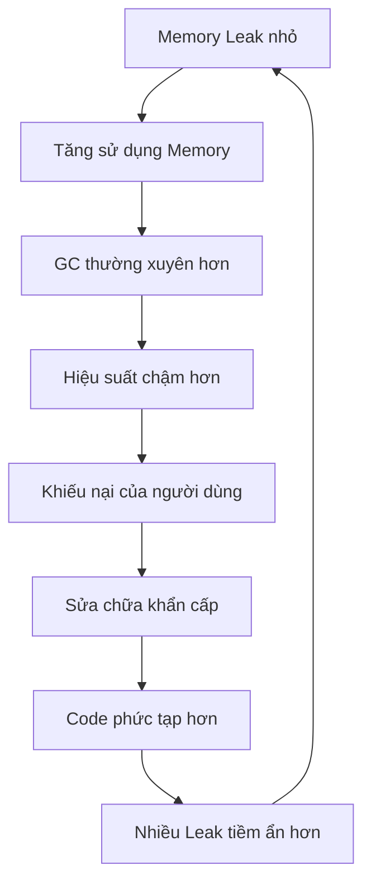

# Tại sao Memory Leak lại quan trọng?

Memory leak là một trong những vấn đề nguy hiểm và tốn kém nhất trong phát triển phần mềm. Mặc dù chúng có vẻ như chỉ là những chi tiết kỹ thuật nhỏ, nhưng tác động của chúng có thể gây ra hậu quả nghiêm trọng đối với ứng dụng, doanh nghiệp và trải nghiệm người dùng. Hiểu rõ tại sao memory leak quan trọng là điều cần thiết cho mọi lập trình viên, bất kể trình độ kinh nghiệm.

## Tác động trong thực tế

### 🚨 Suy giảm hiệu suất hệ thống

Memory leak không chỉ tiêu thụ RAM mà còn dần dần "bóp nghẹt" hiệu suất ứng dụng của bạn:

- **Thời gian phản hồi chậm hơn**: Khi bộ nhớ khả dụng giảm, ứng dụng dành nhiều thời gian hơn cho garbage collection và quản lý bộ nhớ
- **Tăng sử dụng CPU**: Hệ thống phải làm việc nhiều hơn để quản lý các không gian bộ nhớ bị phân mảnh
- **Giảm throughput**: Ứng dụng có thể xử lý ít hoạt động đồng thời hơn khi bộ nhớ trở nên khan hiếm

### 💰 Hậu quả tài chính

Chi phí của memory leak vượt xa thời gian phát triển:

#### Chi phí hạ tầng Cloud

- Tăng số lượng server instances để bù đắp cho việc bộ nhớ bị phình to
- Kích hoạt auto-scaling cao hơn dẫn đến phân bổ tài nguyên không cần thiết
- Lãng phí tài nguyên tính toán có thể được sử dụng cho logic kinh doanh thực tế

#### Tác động kinh doanh

- Mất doanh thu do ứng dụng ngừng hoạt động
- Khách hàng rời bỏ do trải nghiệm người dùng kém
- Tăng chi phí hỗ trợ từ các vấn đề liên quan đến hiệu suất

### 📱 Suy giảm trải nghiệm người dùng

Memory leak tác động trực tiếp đến người dùng cuối:

- **Ứng dụng di động**: Hao pin, thiết bị nóng lên và ứng dụng crash
- **Ứng dụng web**: Tab trình duyệt crash, tải trang chậm và giao diện không phản hồi
- **Ứng dụng desktop**: Hệ thống đóng băng, ứng dụng crash và mất dữ liệu

## Các tình huống phổ biến mà Memory leak gây ra hỗn loạn

### Nền tảng thương mại điện tử

```text
Trong đợt sale Black Friday:
- Chức năng giỏ hàng trở nên chậm chạp
- Quá trình thanh toán thất bại, không liên tục
- Server crash trong lúc traffic cao nhất
- Kết quả: Mất hàng triệu đô la doanh thu
```

### Ứng dụng game

```text
Trong các phiên chơi game kéo dài:
- Frame rate giảm dần theo thời gian
- Việc tải thế giới game trở nên chậm hơn
- Cuối cùng crash, mất tiến trình của người chơi
- Kết quả: Đánh giá xấu và người chơi rời bỏ
```

### Ứng dụng doanh nghiệp

```text
Trong hoạt động kinh doanh 24/7:
- Hệ thống CRM trở nên không phản hồi
- Các job xử lý dữ liệu thất bại
- Quy trình tự động bị dừng
- Kết quả: Gián đoạn kinh doanh và mất năng suất
```

## Bản chất ẩn giấu của Memory leak

### Tại sao chúng khó phát hiện

1. **Suy giảm dần dần**: Memory leak thường phát triển chậm, khiến chúng khó nhận thấy trong quá trình phát triển
2. **Khác biệt môi trường**: Chúng có thể chỉ biểu hiện dưới điều kiện tải production
3. **Tương tác phức tạp**: Các ứng dụng hiện đại có chuỗi phụ thuộc phức tạp nơi leak có thể ẩn náu
4. **Triệu chứng không liên tục**: Các vấn đề hiệu suất có thể dường như ngẫu nhiên hoặc được quy cho các nguyên nhân khác

### Hiệu ứng tuyết lở

Memory leak có tính chất tích lũy:



## Thống kê ngành

*Lưu ý: Các thống kê sau đây đại diện cho xu hướng chung của ngành và quan sát từ cộng đồng phát triển phần mềm.*

### Tác động phát triển

- **Phần lớn** vấn đề production trong ứng dụng chạy lâu dài liên quan đến memory
- Memory leak là **nguyên nhân hàng đầu** gây ra việc khởi động lại ứng dụng không lên kế hoạch
- **Tỷ lệ đáng kể** vấn đề hiệu suất do khách hàng báo cáo có nguồn gốc từ quản lý bộ nhớ

### Tác động tài chính

- Chi phí downtime cho các trang thương mại điện tử có thể dao động từ **hàng nghìn đến hàng chục nghìn đô la mỗi phút**
- Sự không hiệu quả về memory có thể **tăng đáng kể** chi phí hạ tầng
- Hiệu suất ứng dụng kém **giảm đáng kể** sự tương tác và giữ chân người dùng

## Thách thức phát triển hiện đại

### Kiến trúc Microservices

- Nhiều service với quản lý bộ nhớ độc lập
- Thất bại lan truyền khi một service có vấn đề memory
- Giám sát phức tạp trên các hệ thống phân tán

### Container Orchestration

- Giới hạn memory có thể gây ra pod termination không mong muốn
- Phân bổ tài nguyên trở nên quan trọng cho tính ổn định
- Horizontal scaling che giấu nhưng không giải quyết memory leak

### Ứng dụng thời gian thực

- Kết nối WebSocket tích lũy memory
- Event listener không được dọn dẹp đúng cách
- Streaming data tích lũy trong memory buffer

## Chi phí của việc bỏ qua

### Technical Debt

Bỏ qua memory leak dẫn đến:

- **Phát triển phản ứng**: Liên tục sửa các vấn đề hiệu suất thay vì xây dựng tính năng
- **Ràng buộc kiến trúc**: Phải thiết kế xung quanh các giới hạn bộ nhớ
- **Phức tạp testing**: Cần testing hiệu suất mở rộng cho những thay đổi đơn giản

### Tinh thần đội ngũ

- **Thất vọng**: Các developer dành thời gian cho các vấn đề hiệu suất bí ẩn
- **Danh tiếng**: Các team trở nên nổi tiếng với ứng dụng "chậm" hoặc "không đáng tin cậy"
- **Tác động nghề nghiệp**: Hiệu suất ứng dụng kém phản ánh kỹ năng phát triển

## Lợi thế của việc phòng ngừa

### Lợi ích chủ động

Khi các team ưu tiên phòng ngừa memory leak:

- **Hiệu suất dự đoán được**: Ứng dụng hoạt động nhất quán dưới tải
- **Chi phí thấp hơn**: Sử dụng tài nguyên hiệu quả giảm nhu cầu hạ tầng
- **Trải nghiệm người dùng tốt hơn**: Ứng dụng ổn định, nhanh tăng sự hài lòng của người dùng
- **Bảo trì dễ dàng hơn**: Quản lý bộ nhớ sạch đơn giản hóa debug và enhancement

### Lợi thế cạnh tranh

Ứng dụng không có memory leak:

- Xử lý tải cao hơn với cùng phần cứng
- Cung cấp trải nghiệm người dùng tốt hơn
- Yêu cầu overhead vận hành ít hơn
- Scale dự đoán được hơn

## Kết luận

Memory leak quan trọng vì chúng đại diện cho một mối đe dọa cơ bản đối với độ tin cậy ứng dụng, sự hài lòng của người dùng và thành công kinh doanh. Trong bối cảnh phần mềm cạnh tranh ngày nay, các ứng dụng gặp vấn đề quản lý bộ nhớ nhanh chóng tụt lại phía sau so với những ứng dụng duy trì việc sử dụng bộ nhớ sạch, hiệu quả.

Đầu tư vào việc hiểu và ngăn chặn memory leak mang lại lợi ích trong:

- **Giảm chi phí vận hành**
- **Cải thiện sự giữ chân người dùng**
- **Tốc độ phát triển cao hơn**
- **Độ tin cậy hệ thống tốt hơn**
- **Nâng cao danh tiếng đội ngũ**

Khi tiếp tục với hướng dẫn này, hãy nhớ rằng mọi kỹ thuật, pattern và best practice mà chúng ta thảo luận đều phục vụ một mục tiêu cuối cùng duy nhất: **xây dựng các ứng dụng mà người dùng có thể tin tưởng, doanh nghiệp có thể dựa vào, và các developer có thể tự hào về**.

::: tip Nhớ rằng
Memory leak không chỉ là vấn đề kỹ thuật - chúng là vấn đề kinh doanh ảnh hưởng đến con người thực và kết quả thực. Thời gian đầu tư vào việc học quản lý bộ nhớ đúng cách là thời gian đầu tư vào sự xuất sắc nghề nghiệp.
:::
