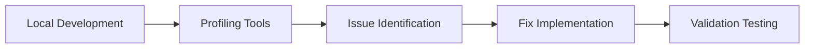
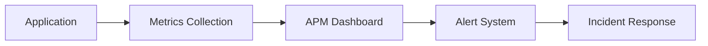

# Công Cụ Phát Hiện Memory Leak

Phần này cung cấp các hướng dẫn toàn diện về các công cụ và tiện ích được sử dụng để phát hiện, phân tích và ngăn chặn memory leak trên các ngôn ngữ lập trình và môi trường khác nhau.

## Các Công Cụ Có Sẵn

### Công Cụ Dựa Trên Browser

#### [Browser Developer Tools](./browser-devtools.md)

Học cách sử dụng các công cụ developer tích hợp sẵn của browser để phát hiện memory leak phía client:

- **Chrome DevTools**: Memory tab, Performance profiling, Heap snapshots
- **Firefox Developer Tools**: Memory analysis, Allocation timeline
- **Safari Web Inspector**: Memory debugging và performance analysis
- **Edge DevTools**: Memory investigation và optimization

*Tốt nhất cho: Frontend JavaScript applications, web performance optimization*

---

### Server-Side Profiling

#### [Node.js Profiling Tools](./nodejs-profiling.md)

Hướng dẫn toàn diện về Node.js memory profiling và monitoring:

- **Built-in Tools**: Node Inspector, V8 profiling options
- **Third-party Libraries**: Clinic.js, 0x, heapdump, memwatch-next
- **Production Monitoring**: APM integration, custom metrics
- **Container Support**: Docker và Kubernetes memory management

*Tốt nhất cho: Node.js applications, server-side JavaScript, microservices*

#### [Java Memory Tools](./java-tools.md)

Công cụ phát hiện và phân tích memory leak Java enterprise-grade:

- **JVM Profilers**: JProfiler, VisualVM, Eclipse MAT
- **Built-in Tools**: JConsole, Java Flight Recorder, jmap
- **APM Solutions**: New Relic, AppDynamics, DataDog
- **Production Deployment**: JVM tuning, monitoring strategies

*Tốt nhất cho: Enterprise Java applications, Spring Boot, microservices*

#### [Go Profiling Tools](./go-tools.md)

Memory profiling và optimization cho ứng dụng Go hiện đại:

- **Built-in Tools**: pprof, trace, runtime profiling
- **Third-party Services**: Pyroscope, Grafana Phlare, Google Cloud Profiler
- **Development Integration**: IDE support, debugging workflows
- **Production Monitoring**: Continuous profiling, metrics collection

*Tốt nhất cho: Go applications, cloud-native services, high-performance systems*

---

### Tích Hợp CI/CD

#### [Tích Hợp CI/CD](./cicd-integration.md)

Phát hiện memory leak tự động trong development pipelines:

- **Platform Integration**: GitHub Actions, GitLab CI, Jenkins, Azure DevOps
- **Automated Testing**: Memory leak detection trong CI/CD
- **Performance Regression**: Automated memory usage comparison
- **Quality Gates**: Memory thresholds và governance

*Tốt nhất cho: DevOps teams, continuous integration, quality assurance*

---

## Hướng Dẫn Lựa Chọn Công Cụ

### Theo Giai Đoạn Development

| Giai Đoạn | Công Cụ Khuyên Dùng | Trường Hợp Sử Dụng Chính |
|-----------|---------------------|---------------------------|
| **Development** | Browser DevTools, IDE profilers | Local debugging, immediate feedback |
| **Testing** | Language-specific profilers, CI/CD tools | Automated testing, regression detection |
| **Staging** | APM tools, performance profilers | Pre-production validation |
| **Production** | APM solutions, continuous profilers | Live monitoring, alerting |

### Theo Loại Ứng Dụng

| Loại Ứng Dụng | Công Cụ Chính | Công Cụ Phụ |
|---------------|---------------|-------------|
| **Web Frontend** | Browser DevTools | Performance monitoring |
| **Node.js Backend** | Node.js profilers, APM | Container monitoring |
| **Java Enterprise** | JVM profilers, APM | Application servers |
| **Go Services** | pprof, continuous profiling | Cloud monitoring |
| **Microservices** | APM, container tools | Service mesh monitoring |

### Theo Quy Mô Team

| Quy Mô Team | Approach Khuyên Dùng | Focus Công Cụ |
|-------------|---------------------|---------------|
| **Cá nhân/Nhỏ** | Built-in tools, open source | Free profilers, browser tools |
| **Trung bình** | Mix của free và commercial | APM trials, team profilers |
| **Enterprise** | Commercial APM, enterprise tools | Full monitoring suites |

## Bắt Đầu

### Quick Start Checklist

1. **Xác Định Stack**: Determine primary programming languages và frameworks
2. **Chọn Development Tools**: Select appropriate profiling tools cho local development
3. **Thiết Lập Monitoring**: Implement basic memory monitoring trong applications
4. **Configure Alerts**: Set up threshold-based alerting cho memory usage
5. **Establish Baselines**: Create memory usage baselines cho normal operations
6. **Plan for Scale**: Consider production monitoring và APM solutions

### Common Integration Patterns

#### Development Workflow

#### Production Monitoring

## Best Practices

### Tool Integration

- **Layer Your Approach**: Use different tools cho different phases
- **Automate Where Possible**: Integrate profiling vào CI/CD pipelines
- **Monitor Continuously**: Implement ongoing production monitoring
- **Establish Baselines**: Create performance và memory baselines
- **Plan for Incidents**: Have memory leak incident response procedures

### Cost Optimization

- **Start Simple**: Begin với built-in và free tools
- **Prove Value**: Demonstrate ROI trước khi investing trong commercial tools
- **Right-size Solutions**: Match tool complexity với team needs
- **Consider Long-term**: Plan cho scaling và team growth

## Đóng Góp

Mỗi tool guide đều mở cho sự đóng góp. Chúng tôi hoan nghênh:

- **Real-world Examples**: Practical use cases và implementations
- **Best Practices**: Industry-proven approaches và patterns
- **Tool Updates**: New features và capability updates
- **Integration Guides**: Step-by-step setup và configuration

Xem [Hướng Dẫn Đóng Góp](https://github.com/lamngockhuong/memory-leak/blob/main/CONTRIBUTING.md) để biết thêm thông tin về cách đóng góp.

---

*Cần help choosing đúng công cụ? Hãy xem [Getting Started Guide](../getting-started.md) hoặc explore individual tool documentation ở trên.*
